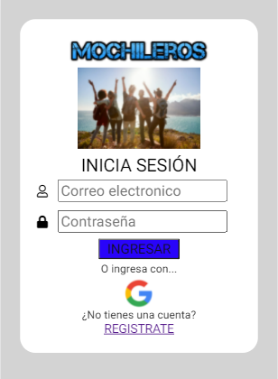

 
 # MOCHILEROS - Social Network 

 ¿Te encanta viajar? ¡Esta es tu comunidad! 

MOCHILEROS  es una red social que te anima a viajar, compartimos las imágenes de los diferentes viajes realizados por nuestros participantes,ellos nos brindan los mejores tips  y nos brindan sus experiencias,también los lugares que le desean conocer.

## RESUMEN DEL PROYECTO
MOCHILEROS  es una Red Social, Single-Page Application (SPA), responsive en la que podamos escribir, leer, actualizar y eliminar datos.

Para ello usamos Firebase, el MVC(Modelo-Vista-Controlador), modularización, CSS, JS y HTML.

## Prototipos de Alta Fidelidad:
✔ Versión Mobile

  ✔ Versión Desktop

## Prototipos Finales:
✔ Versión Mobile

✔ Versión Desktop

## Funcionalidad
Nuestros usuarios de MOCHILEROS deben realizar las siguientes acciones:

Crear una cuenta con un correo electrónico válido y una contraseña. Al crear su cuenta, recibirá un mensaje de confirmación en el correo que haya ingresado para iniciar sesión.
También es posible que pueda loguearse a través de su cuenta de Google,por tanto ya no sería necesario registrarse.
Una vez que logre logueado, podrá ver su perfil sin la necesidad de recargar la página. En el caso que el usuario ingrese por primera vez creando una cuenta; el perfil aprecerá con un avatar y una foto de portada por defecto, el caso es diferente si el usuario se ha logueado con su cuenta de google pues tendrá su foto de perfil y nombre de usuario que tiene en su cuenta correspondiente.

POSTS:
El usuario podrá crear  una publicación de texto ,imágenes.
Puede ver los post públicos que han creado hasta ese momento, puede cambiar los post ya sea PRIVADO o PÚBLICO.
Una vez que ya tiene la publicación podrá editar el contenido,también tiene la opción de eliminar el post.
Puede dar likes.
COMENTARIOS:
Puede escribir comentarios.
Tiene la opción de EDITAR y ELIMINAR. 

## Objetivos de aprendizaje

### HTML y CSS

* [✔] [Uso de HTML semántico.](https://developer.mozilla.org/en-US/docs/Glossary/Semantics#Semantics_in_HTML)
* [✔] Uso de selectores de CSS.
* [✔] [Uso de flexbox en CSS.](https://css-tricks.com/snippets/css/a-guide-to-flexbox/)
* [] [Uso de CSS Grid Layout](https://css-tricks.com/snippets/css/complete-guide-grid/)

### DOM y Web APIs

* [✔] Uso de selectores del DOM.
* [✔] Manejo de eventos del DOM (addEventListener, removeEventListener,
Event objeto, delegación de eventos)
* [✔] [Manipulación dinámica del DOM](
  https://developer.mozilla.org/es/docs/Referencia_DOM_de_Gecko/Introducci%C3%B3n)
(appendChild | createElement | createTextNode | innerHTML | textContent | etc.)
* [✔] Implementación de routing ([History API.](
  https://developer.mozilla.org/es/docs/DOM/Manipulando_el_historial_del_navegador
  ) | `hashchange`)

### JavaScript

* [✔] Uso de condicionales (if-else | switch | operador ternario)
* [✔] Uso de funciones (parámetros | argumentos | valor de retorno)
* [ ] Manipular arrays (filter | map | sort | reduce)
* [✔] Manipular objects (key | value)
* [✔] Uso ES modules ([`import`](https://developer.mozilla.org/en-US/docs/Web/JavaScript/Reference/Statements/import)
| [`export`](https://developer.mozilla.org/en-US/docs/Web/JavaScript/Reference/Statements/export))
* [✔] Diferenciar entre expression y statements.
* [✔] Diferenciar entre tipos de datos atómicos y estructurados.
* [✔] [Uso de callbacks.](https://developer.mozilla.org/es/docs/Glossary/Callback_function)
* [✔] [Consumo de Promesas.](https://scotch.io/tutorials/javascript-promises-for-dummies#toc-consuming-promises)

### Testing

* [✔] [Testeo unitario.](https://jestjs.io/docs/es-ES/getting-started)
* [✔] [Testeo asíncrono.](https://jestjs.io/docs/es-ES/asynchronous)
* [✔] [Uso de librerias de Mock.](https://jestjs.io/docs/es-ES/manual-mocks)

### Estructura del código y guía de estilo

* [✔] Organizar y dividir el código en módulos (Modularización)
* [✔] Uso de identificadores descriptivos (Nomenclatura | Semántica)
* [✔] Uso de linter (ESLINT)

### Git y Github

* [✔] Uso de comandos de git (add | commit | pull | status | push)
* [✔] Manejo de repositorios de GitHub (clone | fork | gh-pages)
* [✔] Colaboración en Github (branches | pull requests | |tags)
* [✔] Organización en Github (projects | issues | labels | milestones)

### Firebase

* [✔] [Firestore.](https://firebase.google.com/docs/firestore)
* [✔] [Firebase Auth.](https://firebase.google.com/docs/auth/web/start)
* [ ] [Firebase security rules.](https://firebase.google.com/docs/rules)
* [✔] Observadores. ([onAuthStateChanged](https://firebase.google.com/docs/auth/web/manage-users?hl=es#get_the_currently_signed-in_user)
 | [onSnapshot](https://firebase.google.com/docs/firestore/query-data/listen#listen_to_multiple_documents_in_a_collection))

### UX

* [✔] Diseñar la aplicación pensando y entendiendo al usuario.
* [✔] Crear prototipos para obtener feedback e iterar.
* [✔] Aplicar los principios de diseño visual (contraste, alineación, jerarquía)
* [✔] Planear y ejecutar tests de usabilidad.

